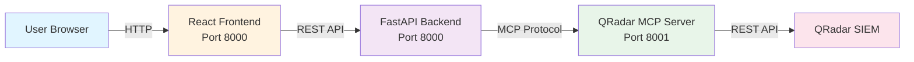

# MCP Client

**Web UI for interacting with QRadar SIEM via MCP (Model Context Protocol)**

A React + FastAPI application that provides a ChatGPT-like interface to query your QRadar security data using natural language.

---

## 🎯 What is This?

MCP Client is the **user-facing web application** that connects to the QRadar MCP Server. It allows security analysts to ask questions in plain English and get instant answers from QRadar.

### Example Queries
- *"Show me top 10 offenses"*
- *"How many open offenses do we have?"*
- *"List all assets"*
- *"Get QRadar system version"*

---

## 🏗️ Architecture



---

## 🚀 Quick Start

### Option 1: Pull Public Image (Recommended)

**No build required!** Pull the pre-built multi-architecture image and start chatting with QRadar instantly.

**Step 1:** Pull the image
```bash
docker pull ghcr.io/<your-username>/mcp-client:latest
```

**Step 2:** Run the container
```bash
docker run -d \
  --name mcp-client \
  -p 8000:8000 \
  -v mcp-client-data:/root/.mcp-client \
  -v mcp-client-logs:/var/log/mcp-client \
  ghcr.io/<your-username>/mcp-client:latest
```

**Step 3:** Open in browser
```
http://localhost:8000
```

**Step 4:** Configure through UI
1. Click **Settings** ⚙️ icon in the top right
2. **Models Tab:**
   - Provider: OpenRouter (or OpenAI)
   - API Key: Your OpenRouter/OpenAI key
   - Model: `meta-llama/llama-3.1-8b-instruct:free` (or any model)
3. **MCP Servers Tab:**
   - Name: QRadar MCP Server
   - URL: `http://<qradar-mcp-server-host>:8001`
4. **QRadar Connections Tab:**
   - Host: Your QRadar console URL
   - API Token: Your QRadar API token
5. Click **Save**

**Step 5:** Start chatting!
- Try: *"Show me top 10 offenses"*
- Try: *"How many assets do we have?"*
- Try: *"Get QRadar version"*

**Supported Architectures:**
- ✅ AMD64 (x86_64) - Intel/AMD processors
- ✅ ARM64 (aarch64) - Apple Silicon, AWS Graviton

**Image Details:**
- Registry: GitHub Container Registry (ghcr.io)
- Image: `ghcr.io/<your-username>/mcp-client:latest`
- Public Access: No authentication needed
- Auto-updated: New commits trigger automatic builds

**Important:** Configuration is stored in your browser's localStorage. If you clear browser data, you'll need to reconfigure.

### Option 2: Build from Source

```bash
# Clone repository
git clone https://github.ibm.com/<your-username>/<repo-name>.git
cd mcp-client

# Build the image
docker build -t mcp-client:latest .

# Run the container
docker run -d \
  --name mcp-client \
  -p 8000:8000 \
  -v mcp-client-data:/root/.mcp-client \
  -v mcp-client-logs:/var/log/mcp-client \
  mcp-client:latest
```

### Option 3: Local Development

```bash
# Backend
cd backend
pip install -r requirements.txt
uvicorn app.main:app --host 0.0.0.0 --port 8000 --reload

# Frontend (separate terminal)
cd frontend
npm install
npm run dev
```

---

## 📦 Container Deployment

### Docker Run (Production)

```bash
# Create volumes for persistence
docker volume create mcp-client-data
docker volume create mcp-client-logs

# Run container
docker run -d \
  --name mcp-client \
  -p 8000:8000 \
  -v mcp-client-data:/root/.mcp-client \
  -v mcp-client-logs:/var/log/mcp-client \
  --restart unless-stopped \
  ghcr.io/<your-username>/mcp-client:latest
```

### Docker Compose

```yaml
version: '3.8'
services:
  mcp-client:
    image: ghcr.io/<your-username>/mcp-client:latest
    container_name: mcp-client
    ports:
      - "8000:8000"
    volumes:
      - mcp-client-data:/root/.mcp-client
      - mcp-client-logs:/var/log/mcp-client
    restart: unless-stopped

volumes:
  mcp-client-data:
  mcp-client-logs:
```

```bash
docker compose up -d
```

### Important: Config Persistence

⚠️ **Always use volume mounts** (`-v`) to persist:
- Model settings (API keys)
- MCP server connections
- Chat history
- User preferences

Without volumes, config is lost when container is removed.

### Access

- **Web UI**: http://localhost:8000
- **Health Check**: http://localhost:8000/api/health

### Backup & Restore Configuration

```bash
# Backup config
docker cp mcp-client:/root/.mcp-client/config.json ./backup-config.json

# Restore config
docker cp ./backup-config.json mcp-client:/root/.mcp-client/config.json
docker restart mcp-client
```

---

## ⚡ Fast Development Workflow (Hot Reload)

### Problem
Docker rebuilds (77+ seconds) are slow during active development.

### Solution: Run Frontend in Dev Mode

**One-time Setup:**

```bash
cd frontend

# Install dependencies
npm install

# Update vite.config.ts to proxy API requests
```

Update `frontend/vite.config.ts`:
```typescript
import { defineConfig } from 'vite'
import react from '@vitejs/plugin-react'

export default defineConfig({
  plugins: [react()],
  server: {
    port: 5173,
    proxy: {
      '/api': {
        target: process.env.VITE_API_URL || 'http://localhost:8000',
        changeOrigin: true,
      }
    }
  }
})
```

**Daily Development:**

1. **Start backend (once per day):**
   ```bash
   # Backend runs in Docker or locally
   docker start mcp-client
   # OR
   cd backend && uvicorn app.main:app --reload
   ```

2. **Start frontend dev server:**
   ```bash
   cd frontend
   npm run dev
   ```

3. **Open browser:**
   ```
   http://localhost:5173
   ```

4. **Make changes and see them INSTANTLY:**
   - Edit any `.tsx`, `.ts`, or `.scss` file
   - Save (Cmd+S or Ctrl+S)
   - Browser auto-refreshes in < 1 second
   - No Docker rebuild needed! ⚡️

### Development Speed Comparison

| Method | Time per Change | Workflow |
|--------|----------------|----------|
| **Docker Rebuild** | ~90 seconds | Edit → Build → Wait → Restart → Refresh |
| **Vite Dev Server** | < 1 second | Edit → Save → Auto-refresh ✅ |

**Time saved per 10 changes: ~15 minutes!**

### When to Rebuild Docker

Only rebuild when:
- ✅ You're done with all frontend changes
- ✅ Deploying to production/staging
- ✅ Backend Python code changed
- ✅ Dockerfile or dependencies changed

### Backend Development

**Edit on server:**
```bash
# SSH to deployment server
ssh user@<server-ip>

# Edit backend files
vi /path/to/mcp-client/backend/app/routers/chat.py

# Restart container
docker restart mcp-client
```

**Run locally with hot reload:**
```bash
cd backend
pip install -r requirements.txt
uvicorn app.main:app --reload --host 0.0.0.0 --port 8000
```

---

## 📋 Centralized Application Logging

All application logs are written to a **single centralized log file**:

```
/var/log/mcp-client/app.log
```

### Log Format

```
2026-02-11 15:30:45 | INFO     | app.routers.chat:156     | [CHAT] New message - chat_id=abc123
2026-02-11 15:30:46 | INFO     | app.pydantic_agent:245   | [TOOL] Calling qradar_get
2026-02-11 15:30:47 | ERROR    | app.routers.chat:178     | [CHAT] Error processing request
```

**Format**: `timestamp | level | module:line | message`

### Accessing Logs

**View live logs:**
```bash
docker exec mcp-client tail -f /var/log/mcp-client/app.log
```

**View last 100 lines:**
```bash
docker exec mcp-client tail -100 /var/log/mcp-client/app.log
```

**Search for errors:**
```bash
docker exec mcp-client grep "ERROR\|Exception" /var/log/mcp-client/app.log
```

**Copy log to local machine:**
```bash
docker cp mcp-client:/var/log/mcp-client/app.log ./mcp-client.log
```

**Use Docker volume (recommended):**
```bash
# Mount log directory to host
docker run -v mcp-client-logs:/var/log/mcp-client ...
```

### Log Rotation

Logs automatically rotate when they reach 50MB:
- `app.log` - Current log (up to 50MB)
- `app.log.1` - Previous backup
- `app.log.2` - Older backup
- ... up to `app.log.5`

Total max size: ~250MB (50MB × 5 files)

### What Gets Logged

- ✅ Application lifecycle (startup, config loading)
- ✅ Chat activity (every message, agent calls, tool executions)
- ✅ Configuration changes (model selection, server connections)
- ✅ Tool execution (name, arguments, results, timing)
- ✅ Errors and exceptions (full stack traces)

### Log Levels

| Level | Used For | Example |
|-------|----------|---------|
| **DEBUG** | Detailed debugging info | Variable values, state dumps |
| **INFO** | Normal operations | Chat messages, tool calls |
| **WARNING** | Potential issues | Agent not configured, retry attempts |
| **ERROR** | Runtime errors | API failures, tool errors |
| **CRITICAL** | System failures | Startup failures, data corruption |

### Monitoring Tips

**Watch for errors in real-time:**
```bash
docker exec mcp-client tail -f /var/log/mcp-client/app.log | grep --color ERROR
```

**Count error occurrences:**
```bash
docker exec mcp-client grep ERROR /var/log/mcp-client/app.log | wc -l
```

**Find rate limit errors:**
```bash
docker exec mcp-client grep "429\|RateLimitError" /var/log/mcp-client/app.log
```

**See only chat activity:**
```bash
docker exec mcp-client grep "\[CHAT\]" /var/log/mcp-client/app.log
```

---

## 🔧 Configuration

### Environment Variables

| Variable | Required | Description |
|----------|----------|-------------|
| `MCP_SERVER_URL` | ✅ Yes | URL of QRadar MCP Server (e.g., http://localhost:8001) |
| `OPENROUTER_API_KEY` | ✅ Yes | API key for LLM (OpenRouter) |
| `MODEL_ID` | ❌ No | LLM model (default: google/gemini-2.0-flash-001) |

### Config File (Alternative)

Create `~/.mcp-client/config.json`:
```json
{
  "llm": {
    "provider": "openrouter",
    "apiKey": "<your-api-key>",
    "model": "google/gemini-2.0-flash-001"
  },
  "mcp": {
    "transport": "http",
    "serverUrl": "http://<qradar-mcp-server-host>:8001"
  },
  "qradar": {
    "host": "https://<qradar-console-url>",
    "token": "<your-qradar-token>"
  }
}
```

---

## 🔍 Features

- **Natural Language Queries** - Ask questions in plain English
- **Real-time Streaming** - SSE streaming for instant responses
- **Chat History** - Persistent conversation threads
- **Table Formatting** - Auto-formatted markdown tables
- **Delete Confirmation** - Safety prompts for destructive operations
- **Dark/Light Mode** - Theme support
- **Centralized Logging** - Single log file for all operations
- **Hot Reload Development** - < 1 second frontend changes

---

## 🚦 Prerequisites

- QRadar MCP Server running (port 8001)
- OpenRouter API key (or compatible LLM API)
- Docker (for container deployment) or Python 3.11+ (for local dev)

---

## 🛠️ Troubleshooting

### Config Not Persisting
**Problem**: Configuration lost after container restart

**Solution**: Ensure you're using a volume mount
```bash
docker run -d -v mcp-client-data:/root/.mcp-client ...
```

### Port Already in Use
**Problem**: `Error: port 8000 already allocated`

**Solution**: Use different port
```bash
docker run -d -p 8080:8000 ...  # Access on port 8080
```

### Cannot Connect to Backend (Dev Mode)
**Problem**: Frontend can't reach backend API

**Solution**: 
- Verify backend is running: `curl http://localhost:8000/api/health`
- Check proxy settings in `vite.config.ts`
- Ensure `VITE_API_URL` env var is set correctly

### Changes Not Reflecting (Dev Mode)
**Problem**: Code changes not showing in browser

**Solution**:
- Hard refresh: `Cmd+Shift+R` or `Ctrl+Shift+F5`
- Check browser console for errors
- Verify Vite dev server is running (check terminal)

### Logs Not Appearing
**Problem**: Log file not created

**Solution**:
```bash
# Verify log directory exists
docker exec mcp-client ls -la /var/log/mcp-client

# Check volume mount
docker inspect mcp-client | grep -A 5 Mounts
```

---

## 📞 Support

**Found a bug?**
1. Open issue at: `https://github.ibm.com/<your-username>/<repo-name>/issues`
2. Provide: steps to reproduce, browser version, logs
3. Include relevant log snippets: `docker exec mcp-client tail -50 /var/log/mcp-client/app.log`

**Feature request?**
- Open issue with **[Feature Request]** prefix

**Need help?**
- Check logs: `docker logs mcp-client` or `docker exec mcp-client tail -f /var/log/mcp-client/app.log`
- Contact: `<your-email>`

---

## ⚠️ Disclaimer

**This is a Minimum Viable Product (MVP) for testing and demonstration purposes only.**

- NOT for production use
- No warranty or support guarantees
