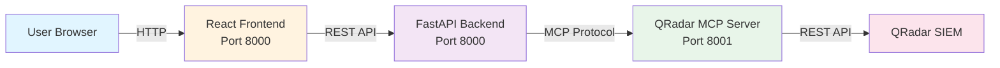

# IBM MCP Client

**Web UI for interacting with QRadar SIEM via MCP (Model Context Protocol)**

A React + FastAPI application that provides a ChatGPT-like interface to query your QRadar security data using natural language.

---

## 🎯 What is This?

IBM MCP Client is the **user-facing web application** that connects to the QRadar MCP Server. It allows security analysts to ask questions in plain English and get instant answers from QRadar.

### Example Queries
- *"Show me top 10 offenses"*
- *"How many open offenses do we have?"*
- *"List all assets"*
- *"Get QRadar system version"*

---

## 🏗️ Architecture



---

## 🚀 Quick Start

### Option 1: Pull Public Image from GitHub (Recommended)

**No build required!** Pull our pre-built multi-architecture image and start chatting with QRadar instantly.

**Public Container Registry:** `ghcr.io/addanuj/mcp-client:latest`

**Step 1:** Pull the image
```bash
docker pull ghcr.io/addanuj/mcp-client:latest
```

**Step 2:** Run the container
```bash
docker run -d \
  --name mcp-client \
  -p 8000:8000 \
  ghcr.io/addanuj/mcp-client:latest
```

**Step 3:** Open in browser
```
http://localhost:8000
```

**Step 4:** Configure through UI
1. Click **Settings** ⚙️ icon in the top right
2. **Models Tab:**
   - Provider: OpenRouter (or OpenAI)
   - API Key: Your OpenRouter/OpenAI key
   - Model: `meta-llama/llama-3.1-8b-instruct:free` (or any model)
3. **MCP Servers Tab:**
   - Name: QRadar MCP Server
   - URL: `http://your-qradar-mcp-server:8001`
4. **QRadar Connections Tab:**
   - Host: Your QRadar console URL
   - API Token: Your QRadar API token
5. Click **Save**

**Step 5:** Start chatting!
- Try: *"Show me top 10 offenses"*
- Try: *"How many assets do we have?"*
- Try: *"Get QRadar version"*

**Supported Architectures:**
- ✅ AMD64 (x86_64) - Intel/AMD processors
- ✅ ARM64 (aarch64) - Apple Silicon, AWS Graviton

**Image Details:**
- Registry: GitHub Container Registry (ghcr.io)
- Image: `ghcr.io/addanuj/mcp-client:latest`
- Public Access: No authentication needed
- Auto-updated: New commits trigger automatic builds

**Important:** Configuration is stored in your browser's localStorage. If you clear browser data, you'll need to reconfigure.

### Option 2: Build from Source (Run as Container)

```bash
# Clone repository
git clone https://github.ibm.com/ashrivastava/IBM-MCP-Client.git
cd IBM-MCP-Client

# Build the image
docker build -t ibm-mcp-client:latest .

# Run the container
docker run -d \
  --name ibm-mcp-client \
  -p 8000:8000 \
  -e MCP_SERVER_URL="http://localhost:8001" \
  -e OPENROUTER_API_KEY="your-key" \
  ibm-mcp-client:latest
```

### Option 3: Local Development (Run as Python Service)

```bash
# Backend
cd backend
pip install -r requirements.txt
uvicorn app.main:app --host 0.0.0.0 --port 8000 --reload

# Frontend (separate terminal)
cd frontend
npm install
npm run dev
```

---

## 🔧 Configuration

### Environment Variables

| Variable | Required | Description |
|----------|----------|-------------|
| `MCP_SERVER_URL` | ✅ Yes | URL of QRadar MCP Server (e.g., http://localhost:8001) |
| `OPENROUTER_API_KEY` | ✅ Yes | API key for LLM (OpenRouter) |
| `MODEL_ID` | ❌ No | LLM model (default: google/gemini-2.0-flash-001) |

### Config File (Alternative)

Create `~/.mcp-client/config.json`:
```json
{
  "llm": {
    "provider": "openrouter",
    "apiKey": "your-api-key",
    "model": "google/gemini-2.0-flash-001"
  },
  "mcp": {
    "transport": "http",
    "serverUrl": "http://localhost:8001"
  },
  "qradar": {
    "host": "https://your-qradar.com",
    "token": "your-token"
  }
}
```

---

## 📁 Project Structure

```
IBM-MCP-Client/
├── Dockerfile              # Multi-stage build (Frontend + Backend)
├── docker-compose.yml      # Full stack deployment
├── frontend/
│   ├── src/
│   │   ├── components/     # React components (Chat, Sidebar)
│   │   ├── App.tsx         # Main app
│   │   └── main.tsx        # Entry point
│   └── package.json
├── backend/
│   ├── app/
│   │   ├── main.py         # FastAPI app
│   │   ├── langgraph_agent.py  # LLM agent with tool calling
│   │   └── mcp_client.py   # MCP protocol client
│   └── requirements.txt
└── README.md
```

---

## 🔍 Features

- **Natural Language Queries** - Ask questions in plain English
- **Real-time Streaming** - SSE streaming for instant responses
- **Chat History** - Persistent conversation threads
- **Table Formatting** - Auto-formatted markdown tables
- **Delete Confirmation** - Safety prompts for destructive operations
- **Dark/Light Mode** - Theme support

---

## 🚦 Prerequisites

- QRadar MCP Server running (port 8001)
- OpenRouter API key (or compatible LLM API)
- Docker (for container deployment)

---

## 📞 Support

**Found a bug?**
1. Open issue at: https://github.ibm.com/ashrivastava/IBM-MCP-Client/issues
2. Provide: steps to reproduce, browser version, logs

**Feature request?**
- Open issue with **[Feature Request]** prefix

**Need help?**
- Check logs: `docker logs ibm-mcp-client`
- Contact: ashrivastava@in.ibm.com

---

## ⚠️ Disclaimer

**This is a Minimum Viable Product (MVP) for testing and demonstration purposes only.**

- NOT for production use
- No warranty or support guarantees
- Use at your own risk
